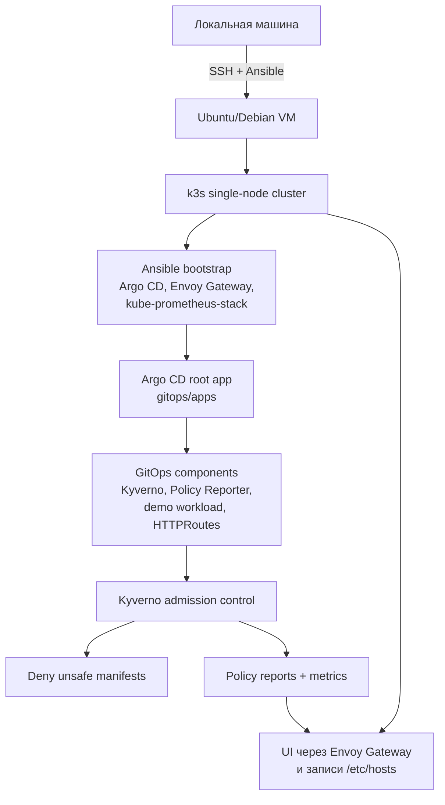

# Kyverno MVP для SRE-тестового задания

В рамках тестового задания нужно развернуть пилотный стенд Kyverno MVP
(`Minimum Viable Product`) для защиты Kubernetes-контура от некорректных и
опасных конфигураций. Главная цель - показать работу Kyverno в условиях,
приближенных к реальным, до полноценного внедрения в production.

Этот репозиторий поднимает одноузловой Kubernetes-стенд на Ubuntu/Debian VM
примерно с 8 GB RAM. Стенд разворачивается с локальной машины через Ansible,
дальше кластерные компоненты доставляются через GitOps, а политики Kyverno
тестируются в CI и реально блокируют небезопасные manifests.

## 1. Что будет развернуто

- Kubernetes: single-node `k3s`;
- GitOps: Argo CD App of Apps;
- входящий трафик: Envoy Gateway + Gateway API;
- observability: kube-prometheus-stack, Prometheus, Grafana;
- policy engine: Kyverno;
- визуализация политик: Policy Reporter;
- набор Kyverno `ClusterPolicy`;
- policy tests через `kyverno test`;
- GitHub Actions gate для проверки policies;
- demo manifests для проверки allow/deny сценариев.

## 2. Архитектура



## 3. Быстрый старт с готовым VirtualBox-образом

Основной путь проверки - готовый VMDK-образ для VirtualBox. VirtualBox должен
быть уже установлен.

1. Скачайте готовый образ из [Google Drive](https://drive.google.com/drive/u/0/folders/12KFXhMZDOBAIlfUQr8mi8j5AHIlLccvG).
   Выберите файл с расширением `.vmdk` — это диск, который нужно подключить к
   создаваемой VM в VirtualBox.
2. Откройте [подробный гайд по запуску VirtualBox-образа со скриншотами](docs/VIRTUALBOX_QUICKSTART.md).

Если готовый образ недоступен, используйте запасные инструкции:

- [docs/VIRTUALBOX_DEBIAN.md](docs/VIRTUALBOX_DEBIAN.md);
- [docs/VM_PREPARATION.md](docs/VM_PREPARATION.md);
- [docs/WSL_ANSIBLE.md](docs/WSL_ANSIBLE.md).

## 4. Подготовить Ansible controller

Все команды ниже выполняются на локальной машине.

Если репозиторий ещё не скачан, установите зависимости и склонируйте его:

```bash
sudo apt update
sudo apt install -y git python3 python3-venv python3-pip sshpass

git clone https://github.com/babim-negev/test-task-mts-maga.git
cd test-task-mts-maga
```

Если репозиторий уже скачан, просто перейдите в его корневую папку:

```bash
cd test-task-mts-maga
```

В корне репозитория создайте и активируйте Python-окружение, затем установите
Ansible:

```bash
python3 -m venv .venv
source .venv/bin/activate
python -m pip install -U pip
python -m pip install ansible
```

Для проверок после развертывания на локальной машине также требуется
установленный `kubectl`.

Для готового VirtualBox-образа используется парольный SSH-доступ, поэтому
`sshpass` нужен Ansible для подключения к готовой VM.

## 5. Настроить inventory

Скопируйте пример:

```bash
cp ansible/inventory.example.ini ansible/inventory.ini
```

Укажите IP вашей VM:

```ini
[kyverno_mvp]
kyverno-vm ansible_host=192.168.x.x ansible_user=mts ansible_password=mts

[kyverno_mvp:vars]
ansible_python_interpreter=/usr/bin/python3
```

Проверьте подключение:

```bash
ansible all -i ansible/inventory.ini -m ping
```

Ожидаемый результат:

```text
kyverno-vm | SUCCESS => ...
```

## 6. Запустить playbook

Запустите полный bootstrap:

```bash
ansible-playbook -i ansible/inventory.ini ansible/playbook.yml
```

Во время запуска playbook:

- проверяет Debian/Ubuntu, CPU, RAM, диск, SSH и `sudo`;
- настраивает базовые пакеты и системные параметры для Kubernetes;
- устанавливает single-node k3s;
- устанавливает Helm и Argo CD;
- устанавливает Envoy Gateway и Gateway API routing;
- устанавливает kube-prometheus-stack;
- применяет Argo CD root Application для `gitops/apps`;
- копирует kubeconfig на локальную машину;
- печатает блок `/etc/hosts` и URL интерфейсов.

После завершения добавьте строки из Ansible output в `/etc/hosts` на машине,
где будет открыт browser.

## 7. Настроить KUBECONFIG

Playbook копирует kubeconfig в:

```text
files/context/config.yaml
```

Подключите его в текущей shell-сессии:

```bash
export KUBECONFIG=$PWD/files/context/config.yaml
```

Проверьте кластер:

```bash
kubectl get nodes -o wide
kubectl get pods -A
```

Ожидаемо: node в состоянии `Ready`, а pods Argo CD, Kyverno, Envoy Gateway,
monitoring и Policy Reporter постепенно переходят в `Running` / `Completed`.

## 8. Открыть UI

После добавления `/etc/hosts` доступны:

| Сервис | URL | Назначение |
|---|---|---|
| Argo CD | `http://argocd.kyverno-mvp.local` | состояние GitOps-приложений |
| Grafana | `http://grafana.kyverno-mvp.local` | метрики кластера и Kyverno |
| Policy Reporter | `http://policy-reporter.kyverno-mvp.local` | результаты срабатывания policies |

Для входа в Argo CD используйте логин `admin`. Получите начальный пароль из
созданного при установке Kubernetes Secret:

```bash
kubectl -n argocd get secret argocd-initial-admin-secret \
  -o jsonpath='{.data.password}' | base64 -d
echo
```

Grafana настроена для просмотра без ручной настройки аккаунта.

Если DNS/hosts пока не настроены, используйте port-forward:

```bash
kubectl -n argocd port-forward svc/argocd-gui 8080:80
kubectl -n monitoring port-forward svc/grafana-gui 3000:80
kubectl -n monitoring port-forward svc/prometheus-gui 9090:9090
kubectl -n policy-reporter port-forward svc/policy-reporter-gui 8081:8080
```

## 9. Проверить Kyverno deny

Все проверки выполняются с локальной машины после `export KUBECONFIG=...`.

Создайте demo namespace:

```bash
kubectl create namespace kyverno-demo --dry-run=client -o yaml | kubectl apply -f -
```

Примените manifest с privileged container:

```bash
kubectl apply -f demo/resources/bad-privileged-pod.yaml
```

Ожидаемый результат: Kubernetes API отклоняет manifest с сообщением Kyverno
policy violation по политике `disallow-privileged-containers`.

Проверьте валидный manifest:

```bash
kubectl apply -f demo/resources/good-pod.yaml
```

Ожидаемый результат: pod создается, потому что manifest соответствует
политикам безопасности.

Дополнительные deny-сценарии:

```bash
kubectl apply -f demo/resources/bad-latest-pod.yaml
kubectl apply -f demo/resources/bad-no-tag-pod.yaml
kubectl apply -f demo/resources/bad-no-resources-pod.yaml
kubectl apply -f demo/resources/bad-root-pod.yaml
```

Проверьте, что результаты политик появились в кластере:

```bash
kubectl get policyreports -A
kubectl -n policy-reporter get pods,svc
```

Проверьте, что метрики Kyverno и Policy Reporter отдаются через ServiceMonitor:

```bash
kubectl -n kyverno get servicemonitor
kubectl -n policy-reporter get servicemonitor
```

После deny-проверок откройте Policy Reporter и Grafana: там должны быть видны
результаты policies и метрики.

## 10. GitOps, policies и CI gate

Argo CD root Application смотрит в:

```text
gitops/apps
```

Дочерние приложения:

| Application | Что доставляет |
|---|---|
| `kyverno` | Kyverno Helm chart и ServiceMonitor |
| `kyverno-policies` | manifests из `policies/clusterpolicies` |
| `policy-reporter` | Policy Reporter и UI |
| `policy-reporter-route` | HTTPRoute для Policy Reporter |
| `kyverno-demo` | валидный demo namespace/workload |

Политики:

| Policy | Назначение |
|---|---|
| `disallow-privileged-containers` | запрещает privileged containers |
| `require-non-root-containers` | требует запуск контейнеров не от root |
| `disallow-latest-image-tag` | запрещает `latest` и образы без tag |
| `require-resource-requests-limits` | требует CPU/memory requests и limits |

Локальная проверка policies:

```bash
kyverno test policies/tests
kyverno apply policies/clusterpolicies -r demo/resources/good-pod.yaml
```

CI workflow:

```text
.github/workflows/kyverno-policy-tests.yml
```

Схема защиты: CI проверяет policies до merge в `main`, а Argo CD
синхронизирует состояние из `main`. Если tests падают, policy не попадает в
защищенную ветку и не раскатывается в кластер.

## 11. Структура репозитория

```text
.
├── ansible/                 # bootstrap VM, k3s, Argo CD, Envoy, monitoring
├── gitops/                  # Argo CD App of Apps и platform manifests
├── policies/                # Kyverno policies и kyverno test fixtures
├── demo/                    # good/bad manifests для ручной проверки
├── docs/                    # VirtualBox, VM, WSL и fallback-гайды
├── files/context/           # локальный kubeconfig после bootstrap
└── .github/workflows/       # GitHub Actions для проверки policies
```

## 12. Troubleshooting

Если Ansible не подключается:

- проверьте IP в `ansible/inventory.ini`;
- проверьте, что VM в режиме `Bridged Adapter`;
- проверьте вход `ssh mts@192.168.x.x`;
- проверьте, что `sudo -n true` внутри VM проходит без пароля.

Если UI не открываются:

- проверьте записи `/etc/hosts`;
- проверьте `kubectl get pods -A`;
- проверьте `kubectl get gateway,httproute -A`;
- временно используйте port-forward из раздела UI.

Если bad manifest не отклоняется:

- проверьте `kubectl -n kyverno get pods`;
- проверьте `kubectl get clusterpolicies`;
- убедитесь, что manifest применяется в namespace `kyverno-demo`;
- проверьте, что политики находятся в режиме `Enforce`.

## 13. Допущения MVP

- Готовый VM-образ использует публичные временные учетные данные `mts` / `mts`.
  Для изолированного тестового стенда это допустимый bootstrap-доступ; при
  дальнейшем использовании пароль следует сменить после первого входа.
- Grafana использует `admin` / `admin`, при этом форма входа отключена, а
  проверяющему доступен анонимный режим `Viewer`. Для MVP в изолированной сети
  это допустимо; в production пароль нужно передавать через Secret или внешний
  менеджер секретов.
