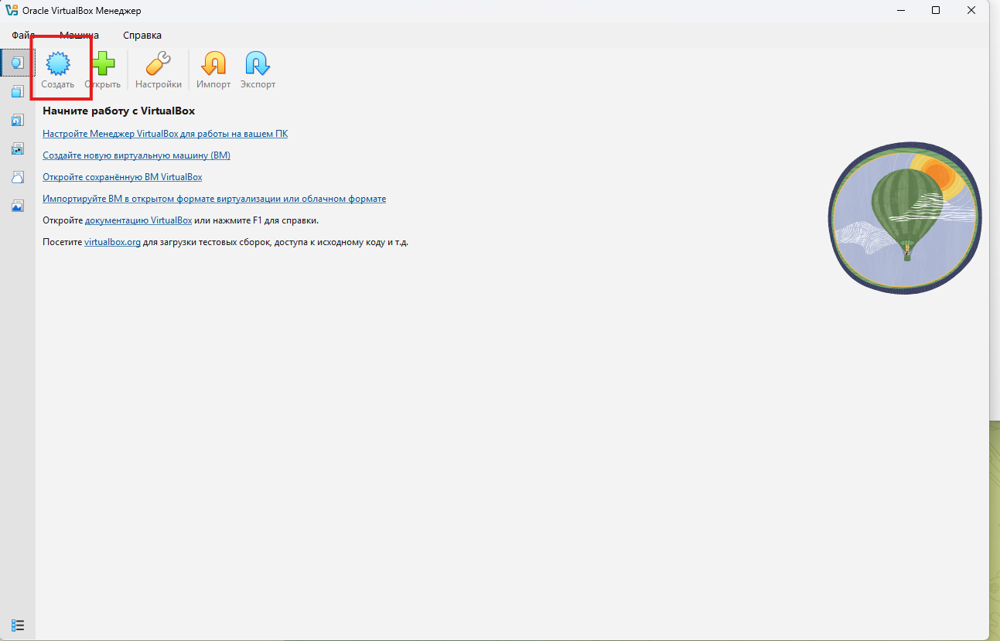
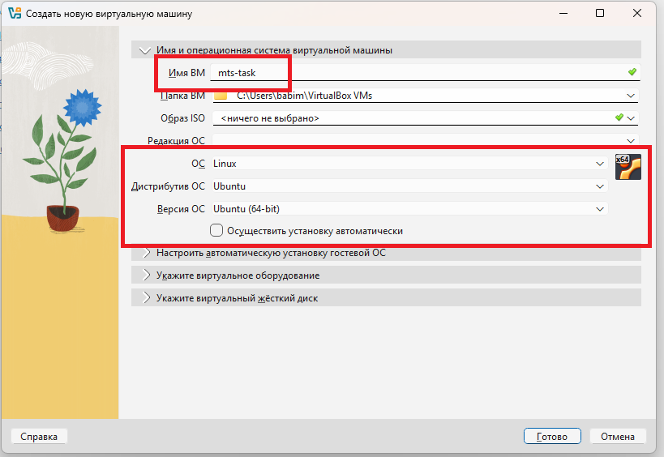
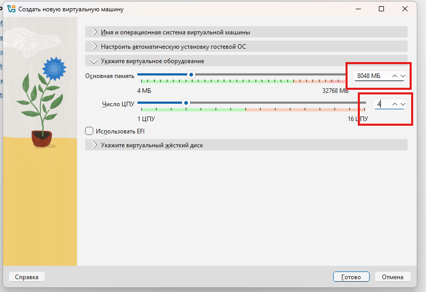
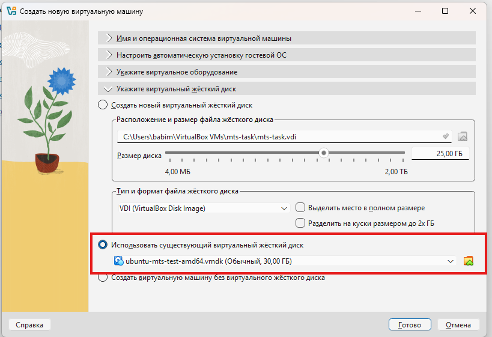
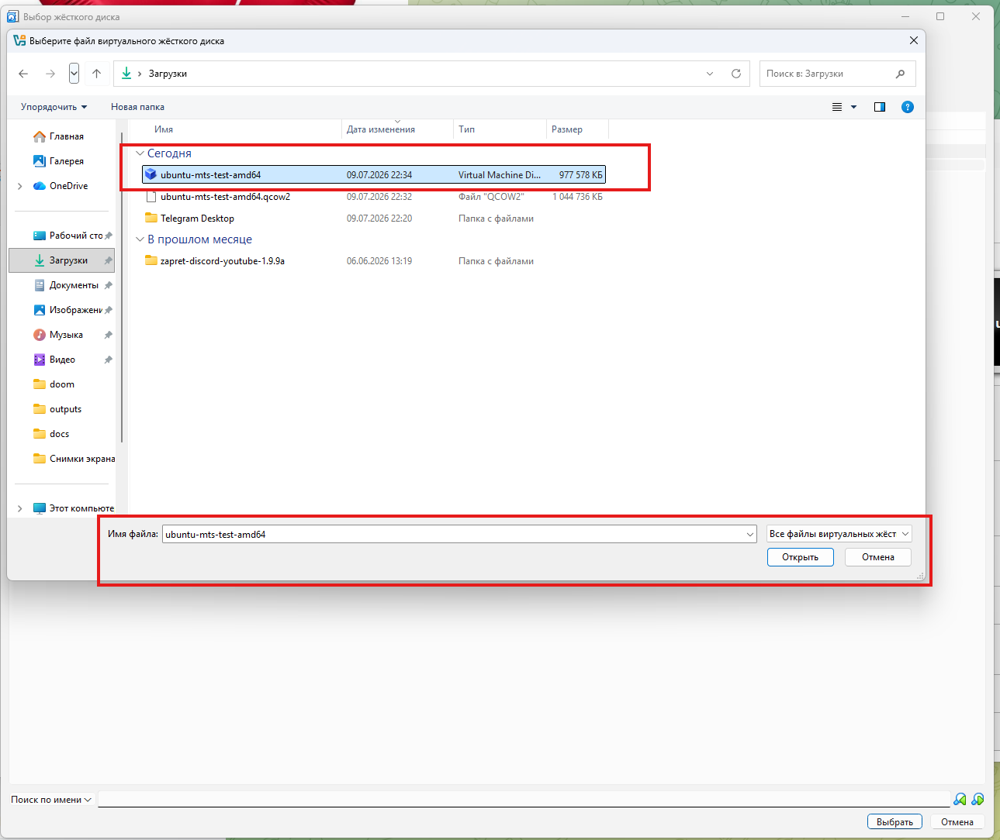
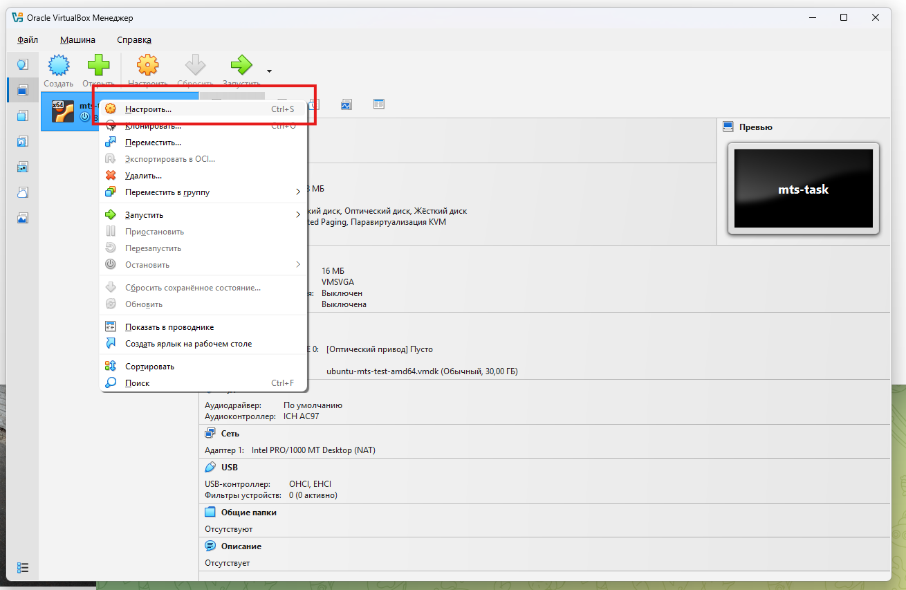
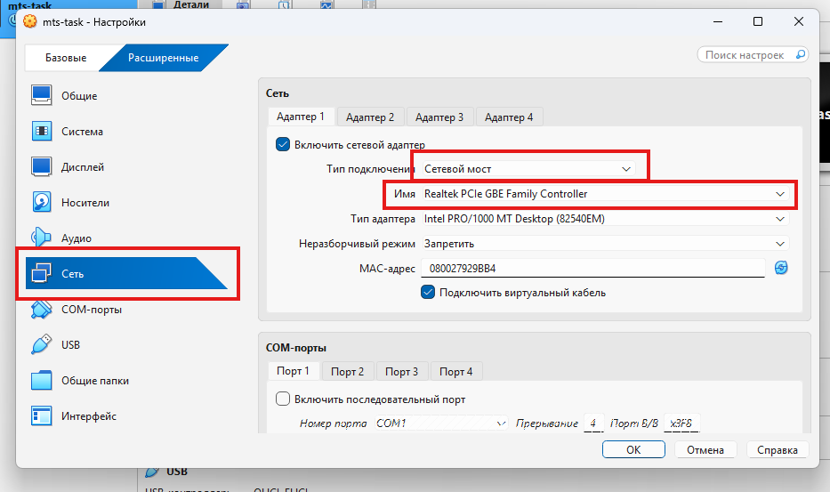
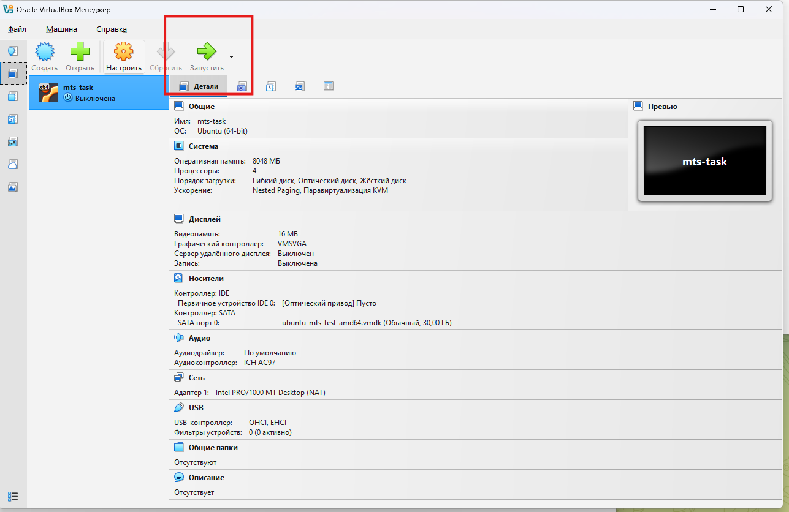
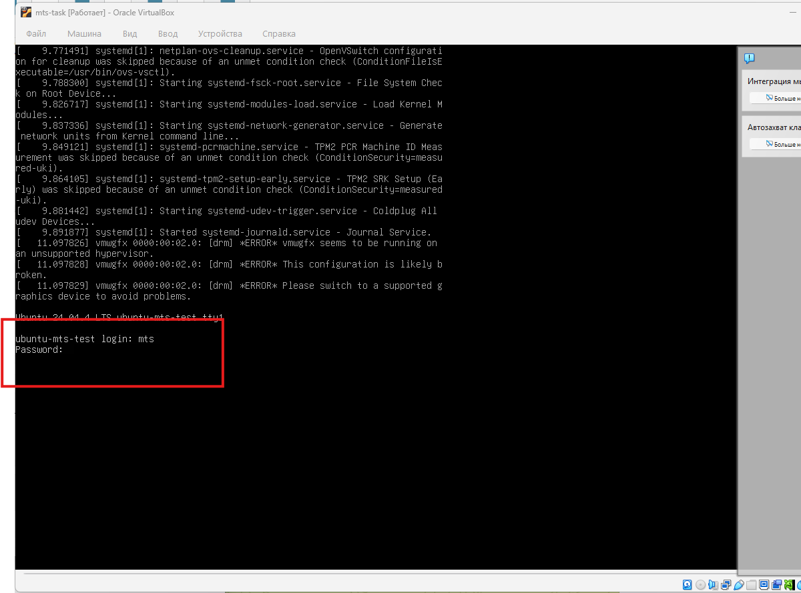
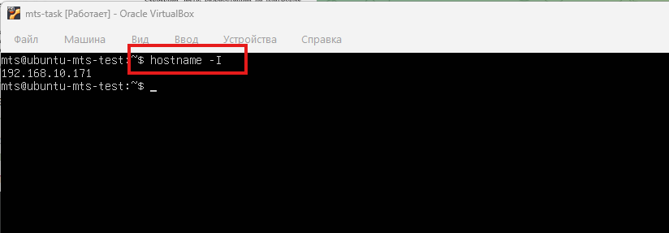

# Быстрый старт VirtualBox с готовым VMDK

Этот гайд нужен, чтобы быстро создать виртуальную машину из готового Ubuntu-диска,
получить IP-адрес VM и потом указать его в `ansible/inventory.ini`.

После подготовки VM вернитесь в основной маршрут:
[README.md, раздел 4](../README.md#4-подготовить-ansible-controller).

## Перед началом

Скачайте готовый VMDK из Google Drive:

```text
https://drive.google.com/drive/u/0/folders/12KFXhMZDOBAIlfUQr8mi8j5AHIlLccvG
```

Для обычного Windows/Linux ноутбука или ПК нужен файл:

```text
ubuntu-mts-test-amd64.vmdk
```

VMDK не нужно открывать двойным кликом в Windows. Его нужно подключить в
VirtualBox как существующий виртуальный жесткий диск.

## ШАГ 1. НАЖАТЬ "СОЗДАТЬ"

Откройте Oracle VirtualBox Manager и нажмите кнопку создания новой виртуальной
машины.



Оценка шага: это правильная точка входа. Не открывайте `.vmdk` через проводник
Windows, потому что Windows не обязана знать, чем открывать файл виртуального
диска.

## ШАГ 2. ЗАДАТЬ ИМЯ VM И ВЫБРАТЬ UBUNTU 64-BIT

Укажите имя VM, например `mts-task`. ISO выбирать не нужно: система уже лежит
внутри готового VMDK-диска.

Рекомендуемые значения:

- `ОС`: `Linux`;
- `Дистрибутив ОС`: `Ubuntu`;
- `Версия ОС`: `Ubuntu (64-bit)`.

Если в списке нет Ubuntu, можно выбрать `Debian (64-bit)`: Ubuntu основана на
Debian, а для VirtualBox этот выбор в основном задает безопасные дефолты
виртуального железа.



Оценка шага: выбор Debian вместо Ubuntu не является причиной ошибки
`No bootable medium found`. Для загрузки важнее правильно подключить диск.

## ШАГ 3. ВЫДАТЬ МИНИМУМ 8 GB RAM И 2 CPU

На шаге ресурсов задайте минимум:

- `8192 MB` RAM;
- `2 CPU`.

Если на машине хватает ресурсов, можно выделить 4 CPU.



Оценка шага: 8 GB RAM и 2 CPU достаточно для single-node k3s-стенда. Меньше
ставить не стоит: Kubernetes-компоненты могут стартовать нестабильно.

## ШАГ 4. УКАЗАТЬ СКАЧАННЫЙ VMDK КАК ЖЕСТКИЙ ДИСК

На шаге выбора диска выберите использование существующего виртуального жесткого
диска. Важно подключать именно `.vmdk`, а не `.qcow2` и не ISO.



Оценка шага: это самый важный шаг. Если диск не подключен как hard disk,
VirtualBox покажет `No bootable medium found`.

## ШАГ 5. ВЫБРАТЬ ФАЙЛ НАШЕГО ДИСКА

В менеджере носителей нажмите добавление диска и выберите скачанный файл:

```text
ubuntu-mts-test-amd64.vmdk
```



Оценка шага: после выбора VMDK он должен появиться как виртуальный жесткий диск
VM. Если видите `.qcow2`, замените его на VMDK или заранее конвертируйте образ.

## ШАГ 6. ПРОВЕРИТЬ НАСТРОЙКИ VM

Перед запуском откройте настройки VM и проверьте базовые параметры:

- диск подключен к SATA-контроллеру как жесткий диск;
- в порядке загрузки включен жесткий диск;
- сеть будет настроена через мост на следующем шаге.



Оценка шага: если VM не загружается, первым делом проверьте здесь, что VMDK
подключен именно как диск, а не как оптический носитель.

## ШАГ 7. ВЫБРАТЬ СЕТЕВОЙ МОСТ И РЕАЛЬНЫЙ СЕТЕВОЙ ИНТЕРФЕЙС

Откройте `Настройки` -> `Сеть` -> `Адаптер 1`.

Укажите:

- `Включить сетевой адаптер`: включено;
- `Тип подключения`: `Сетевой мост`;
- `Имя`: реальный Wi-Fi или Ethernet-адаптер вашей машины.

Не выбирайте VPN/TAP/Host-only адаптеры, например `Radmin VPN`, если VM должна
получить адрес в вашей обычной локальной сети.



Оценка шага: если внутри Ubuntu `hostname -I` ничего не показывает, почти всегда
выбран не тот host-интерфейс для моста.

## ШАГ 8. ЗАПУСТИТЬ VM

Запустите виртуальную машину кнопкой `Старт` / `Запустить`.



Оценка шага: если появляется `No bootable medium found`, вернитесь к шагам 4-6 и
проверьте подключение VMDK как жесткого диска.

## ШАГ 9. ВОЙТИ ПОД ПОЛЬЗОВАТЕЛЕМ MTS

В консоли VM используйте учетные данные:

```text
login: mts
password: mts
```



Оценка шага: этот пользователь уже подготовлен для дальнейшего Ansible-запуска.
Пароль `mts` также используется для первичной SSH-проверки.

## ШАГ 10. ВВЕСТИ HOSTNAME -I И ЗАПОМНИТЬ IP

Внутри VM выполните:

```bash
hostname -I
```

Запомните IPv4-адрес вида `192.168.x.x`, `10.x.x.x` или похожий адрес вашей
локальной сети. `127.0.0.1` не подходит.



Оценка шага: этот IP нужен в `ansible/inventory.ini`. Если IP нет, проверьте
сетевой мост и выбранный физический адаптер в VirtualBox.

## Проверить SSH с локальной машины

На машине, где будет запускаться Ansible, выполните:

```bash
ssh mts@192.168.x.x 'whoami && sudo -n true && hostname'
```

Замените `192.168.x.x` на IP из предыдущего шага.

Ожидаемый результат:

```text
mts
ubuntu-mts-test
```

Если SSH-подключение работает, VM готова.

## Продолжить установку стенда

Дальше нужно подготовить Python virtualenv, заполнить `ansible/inventory.ini` и
запустить playbook. Продолжайте с
[раздела 4 «Подготовить Ansible controller» в README](../README.md#4-подготовить-ansible-controller).
